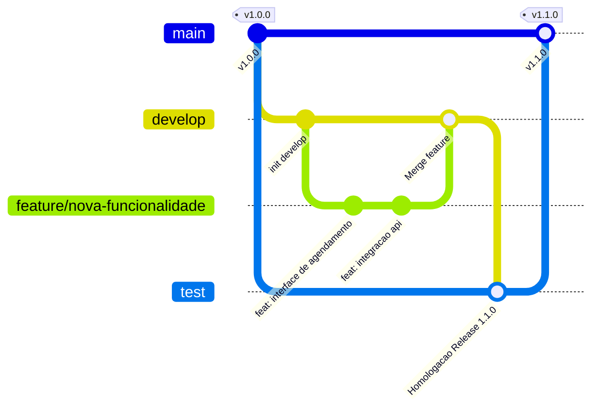

# 🎓 SAP IComp - Sistema de Apoio Pedagógico

> **Sistema de Apoio Pedagógico do Instituto de Computação (ICOMP / UFAM)**  
> *Uma abordagem moderna, segura e integrada para a gestão de atendimentos, acompanhamento pedagógico e suporte a discentes (com foco especial em alunos neurodivergentes e PCD) no Instituto de Computação da Universidade Federal do Amazonas.*

---

## 📑 Sumário

- [Contexto Acadêmico & Stakeholders](#-contexto-acadêmico--stakeholders)
- [Visão Geral](#-visão-geral)
- [Público-Alvo e Atores do Sistema](#-público-alvo-e-atores-do-sistema)
- [Módulos e Funcionalidades (Requisitos)](#-módulos-e-funcionalidades-requisitos)
- [Arquitetura do Sistema & Modelo C4](#-arquitetura-do-sistema--modelo-c4)
- [Stack Tecnológica](#-stack-tecnológica)
- [Estrutura do Repositório](#-estrutura-do-repositório)
- [Padrões de Nomenclatura e Convenções](#-padrões-de-nomenclatura-e-convenções)
- [Como Executar o Projeto](#-como-executar-o-projeto)
  - [Pré-requisitos](#pré-requisitos)
  - [Execução via Docker & Make (Recomendado)](#execução-via-docker--make-recomendado)
  - [Execução Manual (Desenvolvimento Local)](#execução-manual-desenvolvimento-local)
- [Scripts e Comandos Úteis](#-scripts-e-comandos-úteis)
- [Processos, Versionamento e Git Flow](#-processos-versionamento-e-git-flow)
- [Equipe do Projeto](#-equipe-do-projeto)
- [Documentação Complementar](#-documentação-complementar)

---

## 🏛️ Contexto Acadêmico & Stakeholders

O **SAP IComp** foi concebido no âmbito da disciplina **ICC418 - Projetos Práticos em Engenharia de Software** do **Instituto de Computação (ICOMP)** da **Universidade Federal do Amazonas (UFAM)**, sob orientação da **Profª Dra. Ana Carolina Oran**.

- **Stakeholder Principal:** Ana Lúcia Machado dos Santos (Técnica de Assuntos Educacionais, responsável pelo Apoio Pedagógico do ICOMP/UFAM).
- **Problema Endereçado:** O processo de apoio pedagógico e acompanhamento de discentes atípicos era realizado de forma manual (planilhas, anotações e e-mails dispersos), dificultando o histórico de atendimentos, o sigilo das informações e a comunicação eficiente com o corpo docente.

---

## 🌟 Visão Geral

O **SAP IComp** é uma aplicação web completa que centraliza, agiliza e assegura o processo de apoio acadêmico e pedagógico do ICOMP/UFAM, com foco primordial no **acompanhamento contínuo de estudantes neurodivergentes (TEA, TDAH, dificuldades de aprendizagem) e PCDs**.

### Pilares da Solução:
1. **Agendamento Público e Autônomo:** Discentes agendam atendimentos de forma simples, recebendo tokens seguros por e-mail para confirmação, cancelamento e reagendamento sem necessidade de conta prévia.
2. **Prontuário Pedagógico Unificado:** Registro estruturado de atendimentos, demandas (emocionais, aprendizagem, socioeconômicas), laudos/diagnósticos (CID) e mapeamento de potenciais e dificuldades individuais.
3. **Relatórios Pedagógicos & Loop de Feedback Docente:** Elaboração de pareceres pedagógicos estruturados com compartilhamento seguro para professores de matérias em que o aluno está matriculado, permitindo que os docentes enviem feedbacks textuais com práticas pedagógicas adotadas.
4. **Governança, Segurança e LGPD:** Controle de permissões baseado em perfis (RBAC), aprovação de contas de acesso e proteção estrita de dados sensíveis de saúde e desempenho acadêmico.

---

## 👥 Público-Alvo e Atores do Sistema

| Ator | Papel no Sistema | Principais Ações |
| :--- | :--- | :--- |
| **Administrador / Pedagogo(a)** | Coordenação Pedagógica | Gerencia disponibilidade na agenda, realiza e registra atendimentos, elabora relatórios pedagógicos, cadastra laudos (CID), aprova novos usuários e analisa feedbacks de docentes. |
| **Professor(a) / Coordenador(a)** | Corpo Docente | Acessa os relatórios pedagógicos dos alunos matriculados em suas disciplinas e submete pareceres/feedbacks textuais sobre a evolução do discente em sala de aula. |
| **Discente (Aluno / Membro IComp)** | Beneficiário do Atendimento | Agenda atendimentos com o apoio pedagógico nos horários disponíveis, recebe notificações transacionais por e-mail e gerencia seu agendamento via token. |

---

## 🚀 Módulos e Funcionalidades (Requisitos)

### 📅 1. Agendamento de Atendimentos (`RF005`, `RF006`)
- Escolha de pedagogo, data e horário disponível em tempo real.
- Notificações automáticas por e-mail com confirmação de agendamento, link de reagendamento e cancelamento.
- Validação automática de slots e bloqueio de horários conflitantes.

### 📋 2. Registro e Histórico de Atendimentos (`RF007`, `RF015`, `RF016`)
- Cadastro completo de discentes com dados acadêmicos, matrícula, curso e diagnósticos/laudos (CID).
- Registro de atendimentos com data/hora, tipo (alinhamento, orientação, acolhimento) e anotações confidenciais.
- Linha do tempo completa da trajetória de atendimento do aluno no ICOMP.

### 📝 3. Relatórios Pedagógicos e Feedback Docente (`RF008`, `RF009`, `RF010`, `RF011`)
- Elaboração de relatórios individuais contendo condição, potenciais, dificuldades, recomendações e conclusões via editor Rich Text (Lexical).
- Compartilhamento seguro restrito aos docentes das turmas/disciplinas do estudante.
- Confirmação de leitura e canal de feedback textual para que o professor informe as adaptações metodológicas realizadas em aula.

### ⚙️ 4. Gestão de Agenda & Disponibilidade
- Criação e visualização de slots de horários semanais/diários pelos pedagogos.
- Atualização dinâmica de status (`CREATED`, `PENDING`, `BOOKED`, `REMOVED`).

### 🔐 5. Gestão de Acessos & Segurança (`RF001`, `RF002`, `RF003`, `RNF002`, `RNF003`)
- Autenticação JWT com controle de rotas por perfis (`PEDAGOGUE`, `PROFESSOR`, `STUDENT`).
- Triagem e aprovação de novas contas de professores e pedagogos.
- Recuperação segura de senha por token com validade temporal via e-mail.

---

## 🏛️ Arquitetura do Sistema & Modelo C4

O sistema é estruturado em três camadas principais (Frontend, Backend e Banco de Dados) seguindo o **Modelo C4**:

```
┌─────────────────────────────────────────────────────────────┐
│                   Frontend (Next.js 16)                     │
│    App Router | Zustand | React Hook Form | Tailwind CSS    │
└──────────────────────────────┬──────────────────────────────┘
                               │ HTTPS / REST API (JSON / JWT)
┌──────────────────────────────▼──────────────────────────────┐
│                 Backend API (Node.js / Express 5)           │
│  ┌───────────────────────────────────────────────────────┐  │
│  │ Presentation Layer (Routes, Controllers, Middlewares) │  │
│  ├───────────────────────────────────────────────────────┤  │
│  │ Application Layer (Use Cases, DTOs, Mappers)          │  │
│  ├───────────────────────────────────────────────────────┤  │
│  │ Domain Layer (Entities, Value Objects, Interfaces)    │  │
│  ├───────────────────────────────────────────────────────┤  │
│  │ Infrastructure Layer (Prisma ORM, PostgreSQL, Mail)   │  │
│  └───────────────────────────────────────────────────────┘  │
└──────────────────────────────┬──────────────────────────────┘
                               │ TCP / SQL Queries
┌──────────────────────────────▼──────────────────────────────┐
│                  Banco de Dados PostgreSQL 17               │
└─────────────────────────────────────────────────────────────┘
```

Para mais detalhes sobre as regras de negócio, isolamento de camadas e contratos de repositório, consulte:  
👉 **[Guia de Arquitetura do Backend](backend/ARCHITECTURE.md)**

---

## 🛠️ Stack Tecnológica

### Frontend
- **Framework:** [Next.js](https://nextjs.org/) 16 (App Router) & [React](https://react.dev/) 19
- **Linguagem:** [TypeScript](https://www.typescriptlang.org/)
- **Estilização & UI:** [Tailwind CSS](https://tailwindcss.com/) v4 & [Lucide Icons](https://lucide.dev/) (design amigável com tons pastéis, em conformidade com acessibilidade sensorial)
- **Gerenciamento de Estado:** [Zustand](https://github.com/pmndrs/zustand)
- **Formulários e Validação:** [React Hook Form](https://react-hook-form.com/) & [Zod](https://zod.dev/)
- **Editor Rich Text:** [Lexical](https://lexical.dev/) (@lexical/react)
- **Comunicação HTTP:** [Axios](https://axios-http.com/)

### Backend
- **Ambiente de Execução:** [Node.js](https://nodejs.org/) (v20+)
- **Framework Web:** [Express.js](https://expressjs.com/) v5
- **ORM & Banco de Dados:** [Prisma ORM](https://www.prisma.io/) com [PostgreSQL](https://www.postgresql.org/) 17
- **Segurança & Autenticação:** `jsonwebtoken` (JWT), `bcrypt`, `cookie-parser`, `express-rate-limit`, `cors`
- **Serviço de E-mail:** [Nodemailer](https://nodemailer.com/) (Integração com Gmail Service)
- **Testes & Qualidade:** [Jest](https://jestjs.io/), [ts-jest](https://kulshekhar.github.io/ts-jest/), [ESLint](https://eslint.org/), [Prettier](https://prettier.io/)

### Infraestrutura & DevOps
- **Containerização:** [Docker](https://www.docker.com/) & [Docker Compose](https://docs.docker.com/compose/)
- **Automação:** `Makefile` com suporte aos ambientes `develop`, `test` e `production`
- **CI/CD:** [GitHub Actions](https://github.com/features/actions) (`.github/workflows/deploy.yml`)

---

## 📂 Estrutura do Repositório

```text
sap-icomp/
├── .github/                 # Workflows de CI/CD (deploy, issue templates, codeowners)
├── docker/                  # Configurações do Docker Compose por ambiente
│   ├── develop/             # Ambiente de Desenvolvimento local/integrado
│   ├── test/                # Ambiente de Testes / Homologação
│   └── production/          # Ambiente de Produção
├── docs/                    # Documentação do projeto e processos de engenharia
│   ├── drive.md             # Link para repositório de documentos no Google Drive
│   └── processes/           # Guias de Gitflow, Commits, Ambientes e Testes
├── backend/                 # Aplicação Backend (Node.js / Express / Prisma)
│   ├── prisma/              # Schemas e migrações do banco de dados
│   ├── src/
│   │   ├── domain/          # Entidades, Value Objects e Contratos de Repositório
│   │   ├── application/     # Casos de Uso e DTOs
│   │   ├── infrastructure/  # Repositórios Prisma, Gateways de E-mail, Banco
│   │   ├── presentation/    # Controllers, Rotas e Middlewares Express
│   │   └── server.ts        # Ponto de entrada (Composition Root)
│   ├── ARCHITECTURE.md      # Guia detalhado da Clean Architecture
│   └── README.md            # Documentação específica do backend
├── frontend/                # Aplicação Frontend (Next.js / React)
│   ├── src/
│   │   ├── app/             # Rotas do Next.js (App Router)
│   │   ├── components/      # Componentes UI reutilizáveis
│   │   ├── features/        # Módulos organizados por funcionalidade de negócio
│   │   ├── providers/       # Context Providers (Auth, Toast, etc.)
│   │   ├── store/           # Stores globais Zustand
│   │   ├── services/        # Clientes de API e requisições HTTP
│   │   ├── types/           # Interfaces e tipos TypeScript
│   │   └── utils/           # Funções utilitárias e navegadores
│   └── README.md            # Documentação específica do frontend
├── Makefile                 # Automação de builds e orquestração Docker
└── README.md                # Visão geral do projeto (este arquivo)
```

---

## 📏 Padrões de Nomenclatura e Convenções

| Tipo de Recurso | Convenção | Exemplos |
| :--- | :--- | :--- |
| **Pastas / Diretórios** | `kebab-case` | `user-profile`, `attendance-types`, `reset-password` |
| **Componentes React** | `PascalCase` | `UserCard.tsx`, `AppointmentModal.tsx`, `SidebarMenu.tsx` |
| **Arquivos de Código (Backend/Frontend)** | `camelCase` | `useAuth.ts`, `apiClient.ts`, `studentRepository.ts` |
| **Entidades / Casos de Uso** | `camelCase` | `registerStudent.ts`, `appointmentGuest.ts` |

---

## 🚀 Como Executar o Projeto

### Pré-requisitos
- [Docker](https://www.docker.com/) e [Docker Compose](https://docs.docker.com/compose/) instalados.
- [Node.js](https://nodejs.org/) (versão 20 ou superior) se for executar localmente sem containers.
- [Make](https://www.gnu.org/software/make/) (disponível por padrão no Linux/macOS ou via WSL no Windows).

---

### Execução via Docker & Make (Recomendado)

1. **Clone o repositório:**
   ```bash
   git clone https://github.com/PES-2026/sap-icomp.git
   cd sap-icomp
   ```

2. **Configure o arquivo de variáveis de ambiente:**
   Crie um arquivo `.env` na raiz do projeto:
   ```env
   ENVIRONMENT=develop
   DB_USER=prisma
   DB_PASSWORD=prisma
   DB_NAME=sapicomp_db
   DB_PORT=5432
   DATABASE_URL=postgresql://prisma:prisma@db:5432/sapicomp_db?schema=public

   BACKEND_PORT=8107
   FRONTEND_PORT=3000
   FRONTEND_HOST=localhost
   FRONTEND_URL=http://localhost:3000

   JWT_SECRET=supersecretjwtkey123
   JWT_TOKEN_EXPIRES=7d
   BASE_DOMAIN=localhost

   GMAIL_USER=seu-email@gmail.com
   GMAIL_APP_PASSWORD=sua-senha-de-app

   NEXT_PUBLIC_API_URL=http://localhost:8107
   ```

3. **Inicie todos os serviços:**
   ```bash
   make start-application ENVIRONMENT=develop
   ```

4. **Acesse as aplicações:**
   - 🌐 **Frontend:** [http://localhost:3000](http://localhost:3000)
   - 🔌 **Backend API:** [http://localhost:8107](http://localhost:8107)
   - 🗄️ **PostgreSQL:** `localhost:5432`

---

### Execução Manual (Desenvolvimento Local)

#### 1. Iniciar o Banco de Dados
```bash
docker run --name sap-postgres -e POSTGRES_USER=prisma -e POSTGRES_PASSWORD=prisma -e POSTGRES_DB=sapicomp_db -p 5432:5432 -d postgres:17-alpine
```

#### 2. Configurar e Iniciar o Backend
```bash
cd backend
cp .env.example .env
npm install
npx prisma migrate dev
npm run prisma:seed
npm run dev
```

#### 3. Configurar e Iniciar o Frontend
Em outro terminal:
```bash
cd frontend
npm install
npm run dev
```

---

## 📜 Scripts e Comandos Úteis

### Comandos do Makefile (Raiz do Projeto)
```bash
make start-application ENVIRONMENT=develop  # Constrói e inicializa todos os containers
make build-backend ENVIRONMENT=develop      # Constrói a imagem Docker do backend
make build-frontend ENVIRONMENT=develop     # Constrói a imagem Docker do frontend
make compose ENVIRONMENT=develop            # Reinicia os serviços via Docker Compose
```

### Comandos do Backend (`/backend`)
```bash
npm run dev           # Inicia o servidor com hot-reload (tsx)
npm run build         # Compila o TypeScript para JavaScript (dist/)
npm run start         # Inicia a versão compilada
npm run lint          # Executa a verificação estática do ESLint
npm run lint:fix      # Corrige erros de linting e importação automaticamente
npm run test          # Executa a suíte de testes com Jest
npx prisma studio     # Abre o dashboard visual do Prisma para explorar o banco
npm run prisma:seed   # Executa o seed para popular dados iniciais
```

### Comandos do Frontend (`/frontend`)
```bash
npm run dev           # Inicia o servidor de desenvolvimento do Next.js
npm run build         # Compila e otimiza a aplicação para produção
npm run start         # Executa a versão de produção do Next.js
npm run lint          # Executa o linter no código do frontend
```

---

## 🔄 Processos, Versionamento e Git Flow

O projeto adota o modelo de ramificação baseado no estado de prontidão do código e separação rigorosa de ambientes:



Consulte os guias detalhados na pasta `docs/`:
- 🌿 **[Fluxo de Branches & Git Flow](docs/processes/gitflow.md)**
- 🌐 **[Guia de Ambientes (Develop, Test, Main)](docs/processes/environments.md)**
- ✍️ **[Padrão de Mensagens de Commit](docs/processes/commits.md)**
- 🧪 **[Roteiro e Casos de Teste](docs/processes/tests_cases.md)**
- 📌 **[Gestão de Tarefas no GitHub Projects](docs/processes/github_projects.md)**

---

## 👥 Equipe do Projeto

Desenvolvido pelos discentes de Engenharia de Software da UFAM:
- **Andrey Angelo Martins da Silveira**
- **David Yan dos Santos Prado**
- **João Vitor Mesquita da Frota**
- **Lucas Eduardo Souza de Moura**
- **Marco Antônio Torres Moraes**
- **Nícolas Araújo Sampaio**
- **Paloma Cristina Nascimento de Paula**
- **Thiago Vinícius Costa Guimarães**

**Orientação:** Profª Dra. Ana Carolina Oran (Disciplina ICC418)

---

## 📚 Documentação Complementar

- 🏛️ **[Arquitetura do Backend (Clean Architecture)](backend/ARCHITECTURE.md)**
- 📂 **[Documentos Oficiais no Google Drive](docs/drive.md)**
- 🐛 **[Template de Relatório de Bugs](docs/processes/bug_report.md)**

---

<div align="center">
  <sub>Desenvolvido com 💚 para o <b>Apoio Pedagógico do Instituto de Computação (ICOMP / UFAM)</b>.</sub>
</div>